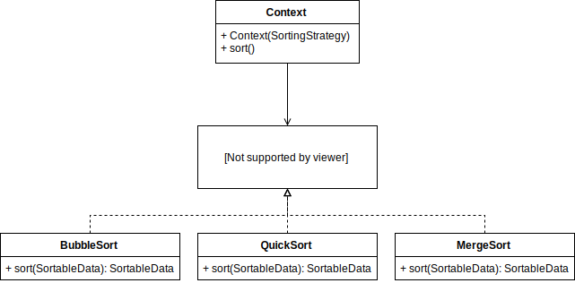

# Návrhový vzor Strategy
Jedná se o jeden z nejjednodušších návrhových vzorů a zjednodušeně nám říká: Použijte kompozici místo dědění.

## Kdy návrhový vzor použít?
Pokud pro řešení daného problém existuje více různých algoritmů, které mají stejné rozhraní (vstup i výstup). Pár příkladů pro lepší představu: 

* Chcete se někam dopravit a máte více možností (auto, autobus, letadlo, ...)
* Potřebujete seřadit pole prvků a máte více algoritmů na řazení
* Různé způsoby ukládání dat (různé formáty souborů, různé externí api, ...)
* Různé zobrazování dat (sloupcový graf, koláčový graf, v tabulce, ...)
* Může jít ale také o použití různých algoritmů v závislosti na časovém vymezení (do určitého roku se něco chová jedním způsobem a od určitého roku zase jiným)

## Jak poznám, že bych mohl kód vylepšit tímto návrhovým vzorem?
Představte si, že máte třídu Živočich a v ní typ [člověk, pes, kočka] a někde v kódu byste chtěli, aby živočich promluvil. Pravděpodobně to zkusíte jedním z následujících způsobů:
* Začnete používat podmínky. Jestliže je Živočich člověk, pak řekne ahoj, jestliže je pes, pak zaštěká nebo
* To samé uděláte za použití funkce switch. 

Druhým místem, kde můžete něco podobného odhalit jsou rostoucí počty tříd, které od sebe dědí. Opět to můžeme ukázat na třídě Živočich. 
Tentokrát si ale vytvoříme třídy Člověk, Pes a Kočka, které dědí od třídy Živočich a implementaci mluvení vložíme přímo do třídy. Možná se toto řešení zdá být lepším, ale představte si, že budu chtít psa vlčáka, jezevčíka, čivavu a takto bych mohl pokračovat. 
Tomuto chování se říká class explosion a opět se dá řešit návrhovým vzorem Strategy.

Pokud tedy vidíte, že se vám v kódu nad proměnnou tvoří sada podmínek nebo se vám tvoří obrovský kolos poděděných tříd, je na čase použít Strategy.

## V čem nám pomáhá?

* Udržuje třídy otevřené pro rozšíření (například přidávání dalších algoritmů), ale uzavřené pro změnu (každý další algoritmus je ve vlastní třídě)
* Eliminuje expanzi tříd

## Jak to vypadá v UML?
Vezmu si první z příkladů, kdy návrhový vzor použít. Dejme tomu, že máme nějaká data a potřebujeme je setřídit. Na základě typu dat nám mohou vzniknout například takovéto požadavky:

* Není potřeba řešit náročnost, chci to hlavně hned.
* Potřebuji, aby se mi data setřídila co nejrychleji.
* Potřebuji, aby třídění zabíralo co nejméně paměti.

## Příklady v kódu
Teorie bylo snad dost, tak se vrhneme na nějakou tu implementaci. U každého příkladu nejdříve ukážu způsob implementace se kterým jsem se setkal a poté jej upravím použitím návrhového vzoru Strategy.

## Závěr
Doufám, že jsem vám pomohl objasnit tento návrhový vzor a budu rád za zpětnou vazbu. Pokud byste něčemu nerozuměli nebo měli návrh na zlepšení, tak mě určitě kontaktujte.